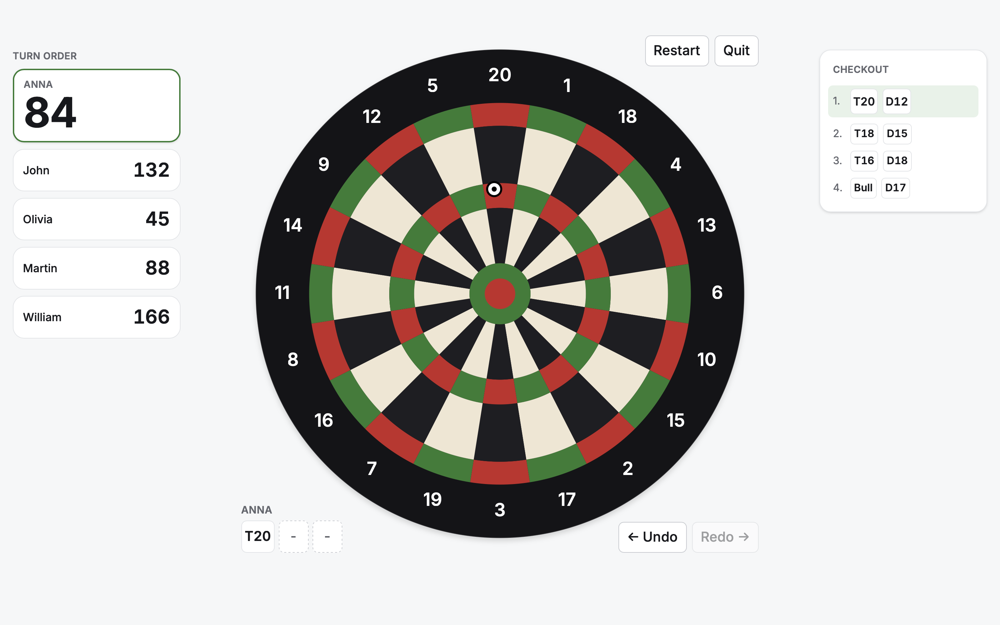
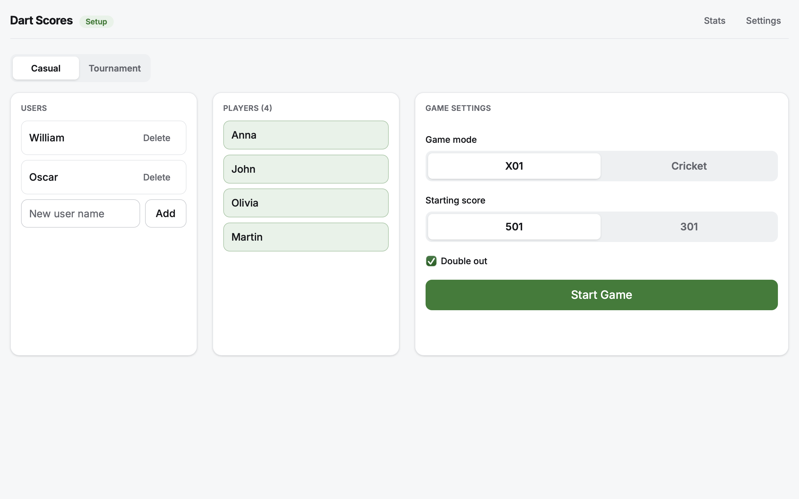
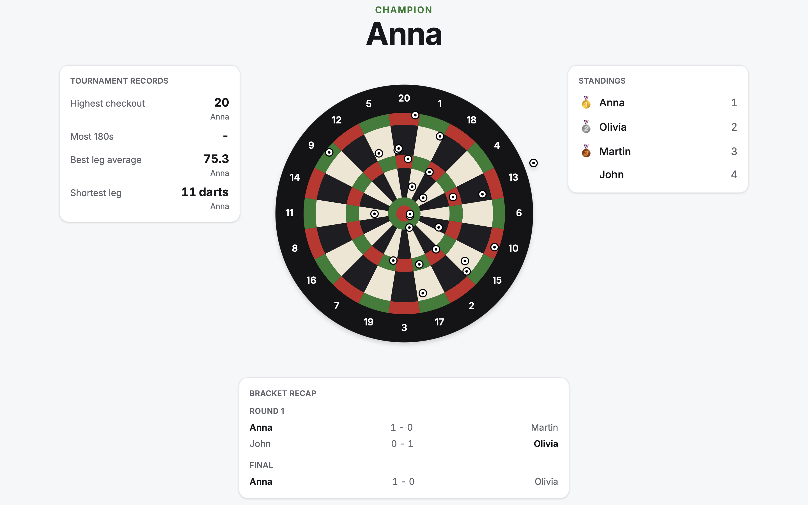

# Dart Scores

A client-only scorer for X01 dart games (301/501), built with React 19, TypeScript, and Vite. No backend - everything is persisted to `localStorage`.

Live at [joavn.dev/dart-scores](https://joavn.dev/dart-scores).

## Features

- X01 scoring (301 or 501, single or double out) and cricket for any number of players
- A saved roster of users you can pick from game to game, plus per-game player selection
- Undo/redo for thrown darts, with keyboard shortcuts
- Checkout suggestions
- Per-player statistics across games
- Light/dark/system theme
- Responsive layout for phone-sized screens
- Tournaments of any size

## Screenshots

<p align="center">
  
  <br>
  <em>Game screen</em>
</p>

<p align="center">
  
  <br>
  <em>Setup screen</em>
</p>

<p align="center">
  
  <br>
  <em>Tournament Results</em>
</p>

## Getting started

```bash
npm install
npm run dev       # start the Vite dev server
```

## Commands

```bash
npm run dev        # start Vite dev server
npm run build       # tsc -b type-check, then vite build
npm run lint        # oxlint
npm test            # vitest (watch mode)
npm test -- run      # vitest single run
npm run preview     # serve the production build locally
```

There is no separate typecheck script; `npm run build` is the source of truth for type errors (`tsc -b` before the Vite build).

## Architecture

```
dartboard/   SVG board rendering + pure geometry/hit-testing (no game rules)
game/        Pure game-rule engines (x01, checkout), no React, no storage
storage/     localStorage read/write + versioned migrations
players/, settings/, stats/   Repositories built on storage/ for each persisted slice
hooks/       useGame wires the x01 engine to storage + React state
screens/, components/   UI
```

Data flows one way: `Dartboard` click → `hitTest.ts` resolves (segment, ring, value) → `PlayScreen` calls `onThrow` → `useGame.throwDart` → `x01Engine.applyThrow` (pure reducer) → new `GameState` → `gameRepository.saveActiveGame` persists it → React re-renders.

See `CLAUDE.md` for a deeper dive into the dartboard geometry, the X01 engine's turn/undo model, and the storage/migration scheme.

## Deploying

This app has no backend of its own but is published as a static build to [joavn.dev/dart-scores](https://joavn.dev/dart-scores), embedded in a separate `Portfolio` repo. `.github/workflows/sync-portfolio.yml` builds with `--base=/dart-scores/` on every push to `main` (when `src/**` or build config changes) and pushes the built `dist/` into the `Portfolio` repo. `sync-portfolio.sh` does the same thing locally/manually.
